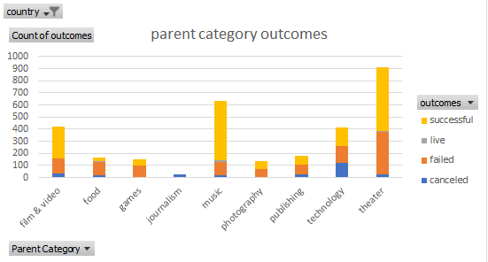
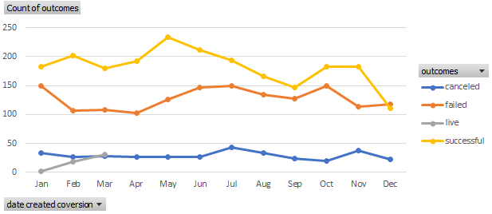
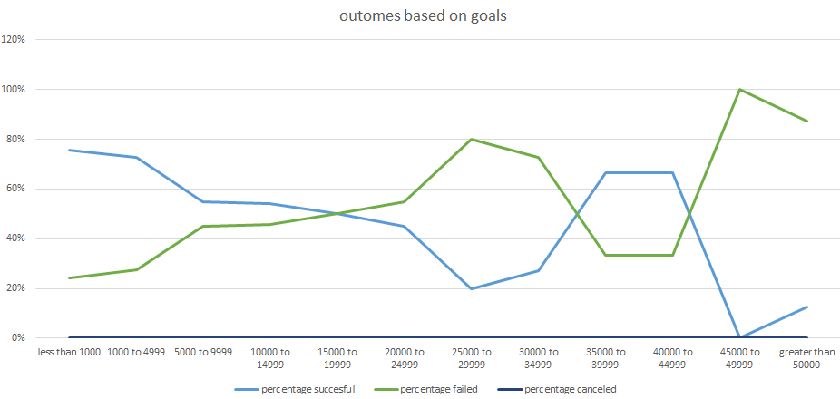
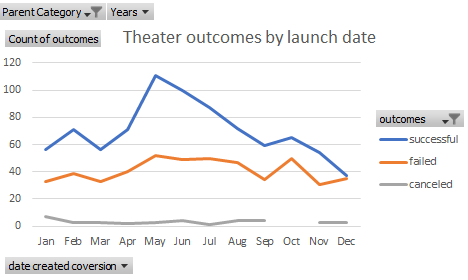

# kickstarter-analysis
An Analysis of Kickstarter Campaigns

## Overview of Project
visualizing campaigns outcomes and the percentage of successful , failed and canceled plays based on funding goals

### Purpose
To analyze the data to be able to make better decisions

## Analysis and Challenges
used Excel to generate charts to better visualize the data

### Analysis of Outcomes Based on Launch Date
the month of May has highest rate of success

### Analysis of Outcomes Based on Goals
when the goal is between 35K and 44999 we tend to have high and stable successful percentage and low failed perncentage and beyond this range successful rate starts to drop and failed percentage increases siginificantly 

### Challenges and Difficulties Encountered
I didnt face any difficulties but I would assume collecting and cleaning the data may be challenging

## Results
the month of May has the highest rate of successful campaigns and the month of December has almost the same rate of successful and failed campaigns
in Regards to goals, as the goal increase beyong 44999 we notice that the success percentage decrease while the fail percentage increase
We can certainly have more graphs based on pledge for example
- What are two conclusions you can draw about the Outcomes based on Launch Date?
the month of May has the highest rate of successful campaigns and the month of December has almost the same rate of successful and failed campaigns

- What can you conclude about the Outcomes based on Goals?
as the goal increase beyong 44999 we notice that the success percentage decrease while the fail percentage increase

- What are some limitations of this dataset?
one main limitation of any dataset is that its historical information. another limitation is that we do not have the cost of each campaign which can be important to make a well informed decision

- What are some other possible tables and/or graphs that we could create?
outcome based on pledge 
